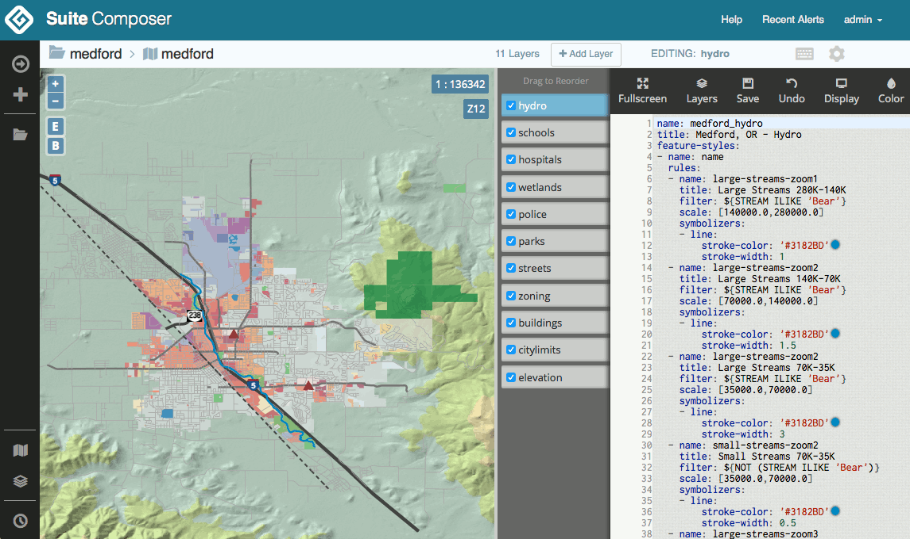

.. _intro.composer:

Composer
========

OpenGeo Suite Composer is a tool for creating, styling and publishing maps. It is available at ``http://localhost:8080/composer/``

   OpenGeo Suite Composer

**Composer is available only with OpenGeo Suite Enterprise**.

For more information about Composer please see the section on :ref:`webmaps.composer`.